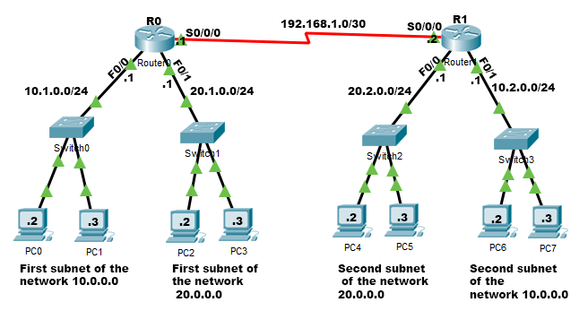

## 🌐 Session 4 — Connecting Two Routers via Serial Interface

### 🕛 Overview

In this session, we expanded our Packet Tracer lab by connecting **two separate LAN-based networks**, each with its own router. The goal was to enable **inter-router communication** using **Serial interfaces**, demonstrating a key concept in **WAN connectivity**.

This setup illustrated how data travels between **multiple networks** through routers interconnected by a **point-to-point serial link**, introducing concepts such as **DCE/DTE roles**, **clock rate configuration**, and **static routing fundamentals**.

> 🔍 **Concept Recap:**
>
> * **DCE (Data Communications Equipment)** — provides the clock signal for synchronization on the serial link. In Packet Tracer, one side of the serial cable is automatically designated as DCE.
> * **DTE (Data Terminal Equipment)** — receives the clock signal from the DCE and adjusts its transmission timing.
> * **Clock Rate** — determines how fast bits are transmitted over the serial link and must be configured on the DCE side using the `clock rate` command.
> * **Static Routing Fundamentals** — defines explicit paths between networks. While not fully configured in this session, we discussed how routers use routing tables to forward packets between subnets.

---

## 🧩 Part 1 — Network Topology Overview

We built a network with two main routers (**R0** and **R1**) interconnected via a **Serial link**. Each router connects to **two separate LANs** through FastEthernet interfaces.

### 🖊️ Addressing Summary

| Network        | Router | Interface | IP Address  | Subnet Mask     | Description                                      |
| :------------- | :----- | :-------- | :---------- | :-------------- | :----------------------------------------------- |
| 10.1.0.0/24    | R0     | Fa0/0     | 10.1.0.1    | 255.255.255.0   | First subnet of network 10.0.0.0 (Switch0, PCs)  |
| 20.1.0.0/24    | R0     | Fa0/1     | 20.1.0.1    | 255.255.255.0   | First subnet of network 20.0.0.0 (Switch1, PCs)  |
| 20.2.0.0/24    | R1     | Fa0/0     | 20.2.0.1    | 255.255.255.0   | Second subnet of network 20.0.0.0 (Switch2, PCs) |
| 10.2.0.0/24    | R1     | Fa0/1     | 10.2.0.1    | 255.255.255.0   | Second subnet of network 10.0.0.0 (Switch3, PCs) |
| 192.168.1.0/30 | R0     | S0/0/0    | 192.168.1.1 | 255.255.255.252 | Serial link to R1 (DCE side)                     |
| 192.168.1.0/30 | R1     | S0/0/0    | 192.168.1.2 | 255.255.255.252 | Serial link to R0 (DTE side)                     |

> 🗿 **Explanation:**
>
> * Each LAN is assigned a unique subnet to avoid conflicts.
> * Routers serve as **default gateways** for their connected PCs.
> * The serial link (192.168.1.0/30) provides inter-router communication.
> * R0 is the **DCE side** (it sets the clock rate), while R1 is the **DTE side**.
> * A /30 subnet gives only 2 usable IPs, which is perfect for point-to-point links (like between two routers).
Since the block size is 4, this subnet includes:

| Type               | Address         | Description                             |
| ------------------ | --------------- | --------------------------------------- |
| Network address    | **192.168.1.0** | identifies the subnet                   |
| First usable host  | **192.168.1.1** | device 1                                |
| Second usable host | **192.168.1.2** | device 2                                |
| Broadcast address  | **192.168.1.3** | used to talk to all hosts in the subnet |

---

## 🔧 Part 2 — Serial Connection Setup

> 🔌 **Serial Connection Explanation:**
>
> The serial cable connects R0 and R1 through their Serial0/0/0 interfaces. In Packet Tracer, you can identify the **DCE side** by hovering over the cable — a small label indicates which end is DCE. The DCE side (R0) must define the **clock rate** to synchronize communication. Without it, the link LEDs stay **orange** instead of **green**.

---

## ⚙️ Part 3 — Router Configuration (CLI)



### 🖥️ R0 Configuration (DCE)

```bash
Router(config)# interface Serial0/0/0
Router(config-if)# ip address 192.168.1.1 255.255.255.252
Router(config-if)# clock rate 19200
Router(config-if)# no shutdown
Router(config-if)# exit
```

### 🖥️ R1 Configuration (DTE)

```bash
Router(config)# interface Serial0/0/0
Router(config-if)# ip address 192.168.1.2 255.255.255.252
Router(config-if)# no shutdown
Router(config-if)# exit
```

> 🐟 **Note:** Only the DCE side (R0) sets a clock rate. Use `show controllers serial` to check which router is DCE.

---

## 🔄 Part 4 — Verification and Testing

After configuring the routers, verify that the **Serial** and **FastEthernet** interfaces show green link lights.

From any PC in R0’s LAN (e.g., 10.1.0.2), test connectivity to a PC in R1’s LAN (e.g., 10.2.0.2):

```bash
ping 10.2.0.2
```

A successful ping confirms that inter-router serial communication and routing between subnets work correctly.

---

## 🧬 Part 5 — OSI Layer Perspective

| OSI Layer           | Device/Function in this Lab      | Example                                |
| :------------------ | :------------------------------- | :------------------------------------- |
| Layer 1 — Physical  | Serial Cable (DCE/DTE), Ethernet | Clock rate synchronization, cabling    |
| Layer 2 — Data Link | Switches                         | Frame forwarding using MAC addresses   |
| Layer 3 — Network   | Routers                          | IP addressing, routing between subnets |
| Layer 4–7           | Not directly configured          | Ping (ICMP) operates at Layer 3–4      |

> 💡 **Insight:** The serial link operates across both the **Physical** and **Network** layers, allowing routers to connect multiple LANs through WAN links.

---

## 📚 Concepts Reinforced

* Routers connect **different networks** via serial or Ethernet interfaces.
* **DCE vs DTE:** DCE provides clock rate timing.
* **Clock Rate Command:** Required only on the DCE side.
* **Each LAN** must have its **own IP subnet**.
* **`no shutdown`** activates router interfaces.
* **`ping`** verifies connectivity between devices.
* Routers operate at **OSI Layer 3**, switches at **Layer 2**.
* **Serial connections** simulate **WAN links** for inter-router communication.

---

## 📝 Exam Tips

* Identify the **DCE side** before setting `clock rate`.
* Each router interface must be on a **different subnet**.
* If Serial LED is **orange**, check:

  * `no shutdown` status
  * Clock rate configuration (on DCE)
* Use `show ip interface brief` to confirm status and addressing.
* Use `ping` for end-to-end connectivity tests.
* Remember: Routers → Layer 3, Switches → Layer 2.
* Clock rate applies **only to serial links**, not Ethernet.

---

## 🏁 Summary

In Session 4, we:

* Expanded our setup to include **two routers (R0 and R1)**.
* Configured **four LANs** using different subnets.
* Established a **Serial connection** between routers (192.168.1.0/30).
* Assigned IPs and set the **clock rate** on the DCE side (R0).
* Verified connectivity using **ping** across networks.
* Reinforced concepts of **WAN links**, **routing**, and **DCE/DTE synchronization**.

> 🗿 *This session bridges LAN fundamentals with WAN concepts, demonstrating inter-router communication over a serial connection.*
