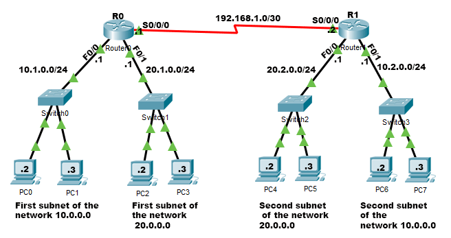

# 🧪 Session 5 — Routing with RIP, Router Configuration & Saving Configs

In this session, I continued building on the network we created in previous labs. This time, I focused on **configuring routing between two routers using RIP version 2**, assigning IP addresses to interfaces, enabling connections on routers and switches, and finally **saving the configuration** so it persists across reloads.

I also worked with the **Serial connection between the routers**, using the DCE side to set the `clock rate`.

---

# 🌐 1. Network Topology (from my lab setup)

In this lab, I used the following network topology:



### **Router R0 Networks**

* **Fa0/0 → 10.1.0.0/24** (Router IP: 10.1.0.1)
* **Fa0/1 → 20.1.0.0/24** (Router IP: 20.1.0.1)
* **Serial0/0/0 → 192.168.1.0/30** (Router IP: 192.168.1.1 — *DCE*)

### **Router R1 Networks**

* **Fa0/0 → 20.2.0.0/24** (Router IP: 20.2.0.1)
* **Fa0/1 → 10.2.0.0/24** (Router IP: 10.2.0.1)
* **Serial0/0/0 → 192.168.1.0/30** (Router IP: 192.168.1.2 — *DTE*)

I will add the lab topology image to the GitHub repo:

---

# 🔎 2. Understanding RIP (Routing Information Protocol)

In this class, we used **RIP Version 2**, so I reviewed what RIP is and why version 2 is required.

## 💡 RIP — What it is

RIP stands for **Routing Information Protocol**, one of the oldest **dynamic routing protocols**. Routers using RIP share their routing tables with neighbors automatically.

---

# 🆚 2.1 RIP Version 1 vs RIP Version 2

### ✔ RIP Version 1 (RIPv1)

* **Classful protocol** → does *not* support subnet masks (like /30 or VLSM). It assumes default classes (A, B, C).
* **Does not send subnet mask information** → routers cannot understand custom subnets.
* **Broadcasts updates** to all devices (255.255.255.255). This wastes bandwidth.
* **Older and less flexible**.

### ✔ RIP Version 2 (RIPv2)

* **Classless protocol** → supports subnet masks and VLSM.
* **Sends subnet masks** in announcements, so routers understand the correct network sizes.
* **Uses multicast (224.0.0.9)** instead of broadcast → more efficient.
* **Supports authentication**.

We always use **RIPv2** in modern setups.

---

# 📌 3. Important RIP Configuration Rules

To configure RIP correctly:

### 🔸 Rule 1 — Only enter *network addresses*, not interface IPs.

If the router interface is `10.1.0.1`, I must enter:

```
network 10.1.0.0
```

Not the actual IP.

### 🔸 Rule 2 — I must be in **global configuration mode** before enabling RIP.

* User mode: `>`
* Privileged EXEC mode: `#`
* Global config mode: `(config)#`

I must enter:

```
enable
configure terminal
```

Before using `router rip`.

---

# 🖥️ 4. Full RIP and Interface Configuration

Below is the complete configuration I used for **both routers**, written exactly as I typed them.

---

# 🟩 R0 — Full Configuration

### 🔽 Step 1 — Enter privileged mode

```
Router> enable
```

### 🔽 Step 2 — Enter global configuration mode

```
Router# configure terminal
```

### 🔽 Step 3 — Configure RIP

```
Router(config)# router rip
Router(config-router)# version 2
Router(config-router)# network 10.1.0.0
Router(config-router)# network 20.1.0.0
Router(config-router)# network 192.168.1.0
```

### 🔽 Step 4 — Configure interfaces

#### FastEthernet0/0

```
Router(config)# interface fa0/0
Router(config-if)# ip address 10.1.0.1 255.255.255.0
Router(config-if)# no shutdown
```

#### FastEthernet0/1

```
Router(config)# interface fa0/1
Router(config-if)# ip address 20.1.0.1 255.255.255.0
Router(config-if)# no shutdown
```

#### Serial0/0/0 (DCE side)

```
Router(config)# interface s0/0/0
Router(config-if)# ip address 192.168.1.1 255.255.255.252
Router(config-if)# clock rate 64000
Router(config-if)# no shutdown
```

Exit:

```
Router(config)# end
```

---

# 🟦 R1 — Full Configuration

### 🔽 Step 1 — Enter privileged mode

```
Router> enable
```

### 🔽 Step 2 — Enter global configuration mode

```
Router# configure terminal
```

### 🔽 Step 3 — Configure RIP

```
Router(config)# router rip
Router(config-router)# version 2
Router(config-router)# network 20.2.0.0
Router(config-router)# network 10.2.0.0
Router(config-router)# network 192.168.1.0
```

### 🔽 Step 4 — Configure interfaces

#### FastEthernet0/0

```
Router(config)# interface fa0/0
Router(config-if)# ip address 20.2.0.1 255.255.255.0
Router(config-if)# no shutdown
```

#### FastEthernet0/1

```
Router(config)# interface fa0/1
Router(config-if)# ip address 10.2.0.1 255.255.255.0
Router(config-if)# no shutdown
```

#### Serial0/0/0 (DTE side)

```
Router(config)# interface s0/0/0
Router(config-if)# ip address 192.168.1.2 255.255.255.252
Router(config-if)# no shutdown
```

Exit:

```
Router(config)# end
```

---

# 💾 5. Saving the Router Configuration

To ensure the router keeps my configuration after shutdown or reload:

## ✔ Method 1 — Simple save

```
write
```

## ✔ Method 2 — Copy running config to startup config

```
copy running-config startup-config
```

(Press Enter twice when prompted.)

---

# 🔍 6. Static Routing vs Dynamic Routing

To better understand RIP, I compared routing methods.

## 🔸 Static Routing

* These are routes I manually add.
* Routers **never learn automatically**; I must define every destination.
* Good for **small networks**.
* Very **predictable** and stable.

## 🔸 Dynamic Routing

Routers exchange information automatically.

### ✔ RIP (Routing Information Protocol)

* **Distance-vector protocol** → routers only know distance (hop count) and direction (next hop).
* **Max hop count = 15** → prevents infinite routing loops.
* **Slow convergence** → routers take time to update after changes.
* Good for small/simple networks.

### ✔ OSPF (Open Shortest Path First)

* **Link-state protocol** → each router builds a full map of the network.
* Faster and scalable.
* Used for medium to large networks.

### ✔ EIGRP (Enhanced Interior Gateway Routing Protocol)

* **Hybrid protocol** → combines distance-vector and link-state ideas.
* Originally Cisco proprietary.
* Very fast and efficient.

---

# 🧪 7. Verifying that RIP Works

I verified my RIP configuration using two methods:

### ✔ Method 1 — Check routing table

```
show ip route
```

I looked for entries starting with **R**:

```
R 10.2.0.0 [120/1] via 192.168.1.2
R 20.2.0.0 [120/1] via 192.168.1.2
```

### ✔ Method 2 — Ping across routers

I sent a ping from a PC on one router's LAN to a PC on the other router's LAN. If the ping succeeds, RIP is working.

---
